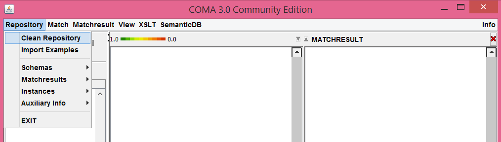
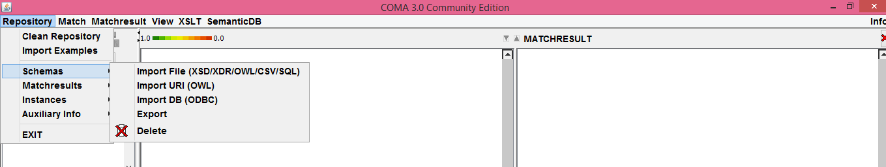
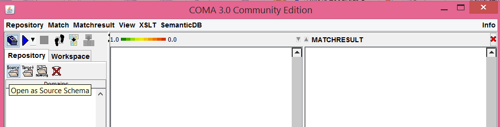
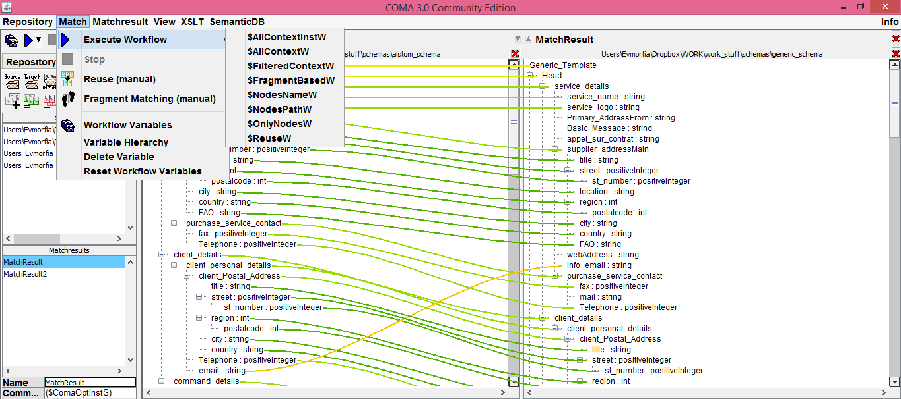
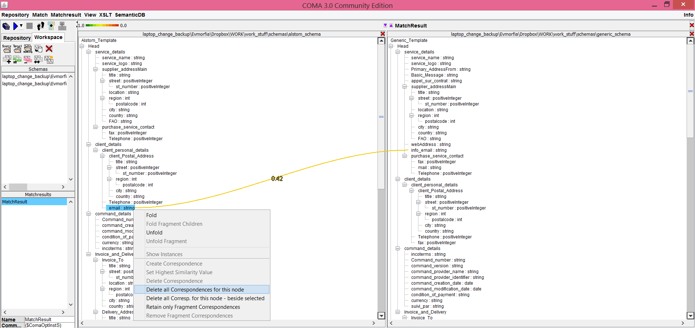
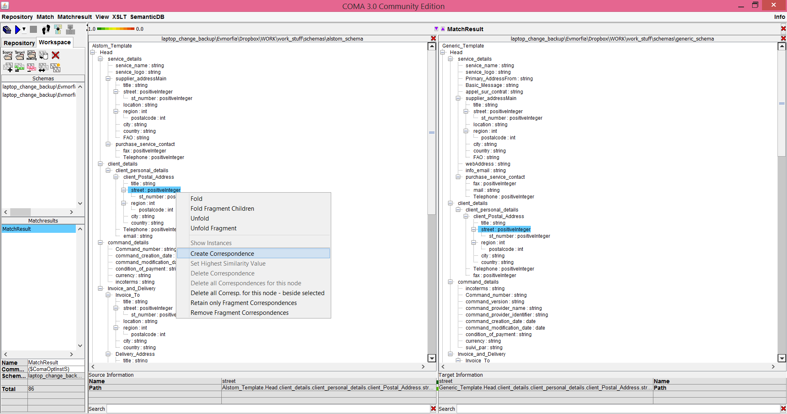
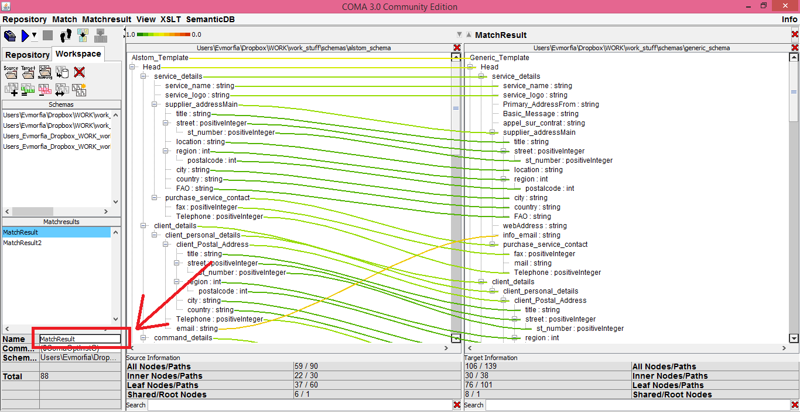
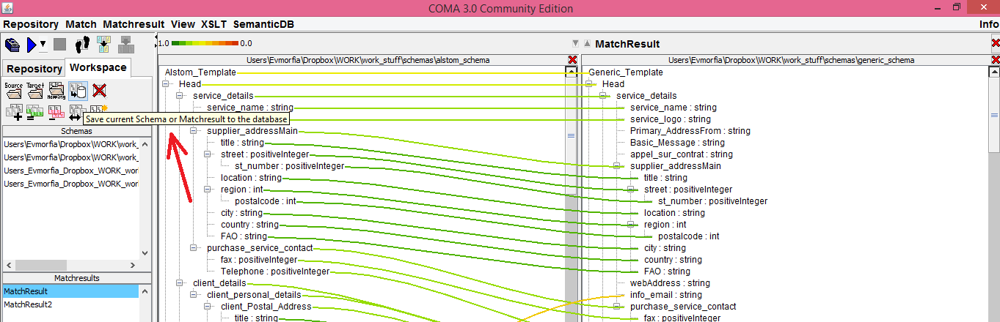
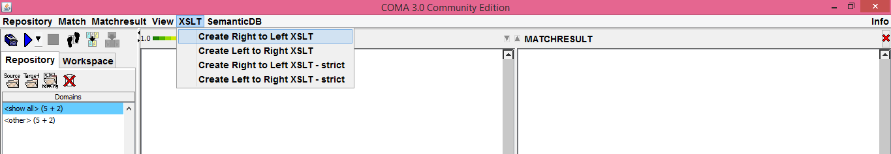
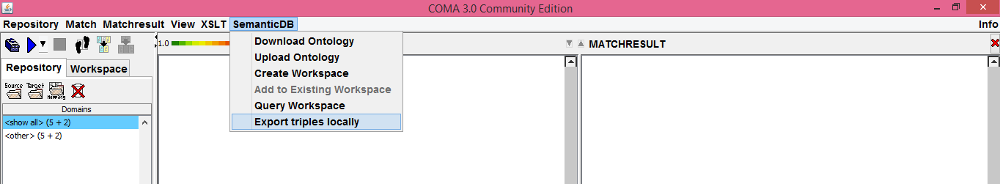

-----------
FITMAN SeMa
-----------

The FITMAN “Metadata and Ontologies Semantic Matching” Specific Enabler attempts to 
match similar semantic content between two sources, aiming both at the acceleration of 
interoperation between different IT systems and at the facilitation of data sharing/integration 
between organisations/departments that utilise different knowledge representations.

>The Metadata and Ontologies Semantic Matching SE aims to support users through the provision 
of an infrastructure which allows the semi-automatic matching of different ontology files (OWL) 
and also of different XML schemas (XSD) . To achieve efficient semantic matching, a number of 
different algorithms (ranging from context-dependent, fragment-based, and reuse-oriented matching) are used. The proposed matching is visualised in an intuitive and user-friendly graphical interface that allows for manual alteration and/or completion when needed. The matching can be persistently stored in a repository for future review and usage. Stored matchings of XSD files in the form of xslt are also available through a REST interface in order for users to be able to retrieve them while stored Ontology matchings allow to perform cross-ontology queries based on the functionalities of the *FI-WARE “Semantic Application Support” GE*.

The current implementation of the FITMAN-SeMa SE is based on the [COMA 3.0 CE toolkit](http://dbs.uni-leipzig.de/en/research/projects/schema_and_ontology_matching/coma_3_0/coma_3_0_community_edition) which is an open source implementation of an advanced schema and ontology matching tool developed by the 
Database Group Leipzig of the Computer Science department of Leipzig university.

The SE makes use of the central remote ontology repository which is be provided by the FI-WARE “Semantic Application Support” GE, in order to retrieve and store ontology files to be used by the COMA 3.0 toolkit, while all the files that are imported to the toolkit for matching (both XSDs and OWL), together with the matching results are persistently stored in a repository (powered by a MySQL instance ).

More specifically, the SE under description supports:
- XLM schema matching: 
In the case of XML schemas, two XSLT files (for right-to-left and left-to-right transformations) will be generated based on the matching between a source schema and a target schema file. This XSLT file can be subsequently used for transforming XML documents that comply with the aforementioned XML Schemas, so as to facilitate interoperability between the departments that use the two different schemas. The XSLT file will be stored locally (to a folder selected by the user) and will be also stored in a remote repository. This will enable other users to retrieve through a web service these XSLT files, using a unique key that 
will be provided to them by the user that generated the XSLT files (in order to permit the sharing of XSLT files only to selected entities)
- Ontologies matching: In the case of ontology matching, the semantic correspondences can be exported in an XML file, while the matching will be stored in the “Semantic Application Support” GE as RDF. This way, a user will be able to obtain information about a particular ontology mapping utilising the SPARQL interface offered by the GE.

For more information, you can also refer to the [FITMAN catalogue.](http://catalogue.fitman.atosresearch.eu/enablers/metadata-and-ontologies-semantic-matching/documentation)

--------
CREDITS
--------
FITMAN-SeMa SE is implemented on top of the [COMA 3.0 CE toolkit](http://dbs.uni-leipzig.de/en/research/projects/schema_and_ontology_matching/coma_3_0/coma_3_0_community_edition) which is an open source implementation of an advanced schema and ontology matching tool developed by the Database Group Leipzig of the Computer Science department of Leipzig university.

--------
Version
--------
1.1.0

--------------
Prerequisites
--------------
* [Java] - JRE 1.6 and higher
* [MySQL] - version 5.5 and higher
* [Maven] - (only if you intend to install from source code)

SeMa can run on any OS.

-----------------
Build and Install
-----------------
### Use the installable version
Unzip the folder you downloaded from Catalogue. Open a terminal (or cmd in Windows) inside the first level of the unziped folder (i.e. the folder inside which you can see a sema_mysql.txt file).
Create and configure the required MySQL database and user by running the following command from cmd (Windows) or bash (Ubuntu). 
> mysql -h localhost -u root -p < sema_mysql.txt

You will be prompted to give the MySQL root password in order for the previous command to be executed.
 
SeMa can be started now by typing on a terminal/cmd the command:
> java -jar FITMAN_SeMa.jar

### Install from source code
Download the source code for SeMa from the link provided in the Catalogue.
Inside the parent folder you will find the file [sema_mysql.txt](./sema_mysql.txt). Open a cmd (Windows) or terminal (Ubuntu) and run the following command. 

> mysql -h localhost -u root -p < sema_mysql.txt

You will be prompted to give the MySQL root password in order for the previous command to be executed.

SeMa, like COMA 3.0 on which it is based is a Maven project, so you can run it as soon as you download it and open it with your preferred IDE. The main class to start is Main.java in the package coma-gui.

-----
Usage
-----
When you *use SeMa for the first time*, you will need to create a new repository. In order to do that, from the main menu select "Repository" and then press "Clean Repository", like you see in the next image. 
You can do that every time you want to delete all the files and the created matchings and empty your database.

####Matching Example####
As an example, in order to import a new xsd file, navigate from the "Repository" menu to "Schemas" and then select the "Import File" option. From there you can choose to import files of the supported by COMA 3.0 CE formats as stated above. 

In order to perform a matching, a source and a target ontology/schema should be selected. 

The content of the files is presented in a tree structure. Select one of the offered matching algorithms. 

After the matching process is finished, the correspondences are visualised inside the main window with coloured lines. You can change the proposed matching manually by double-clicking nodes and edges in the main window:

If you want to keep the generated matching, you can give to it a name and then save it to the database:

####XSLT menu####
When performing a matching between two different xml schemas (i.e. xsd files), you may create an xslt file based on the matching, in order to automatically transform xml files conforming to the source schema to xml files conforming to the target schema and vice versa.
In order to do that, under the XSLT menu, you have the options to create left to right and right to left xslt files. There are two additional options, marked as "strict". The difference between the two is that although the first option will work for every xsd matching, it does not support the use of "for-each" statements, due to possible structural inconsistencies between the two schemas. The "strict" option assumes that the proposed matching does not suffer from this problem and therefore "for-each" statements are used.

The xslt is also stored in a remote repository from which it can later be retrieved through a simple HTTP GET call through any web browser.

####Semantic matching menu####
SeMa is connected to the FI-WARE “Semantic Application Support” GE and therefore allows users to upload to and download intologies from the GE's remote repository. It also enables the creation of new remote semantic workspaces where the user can store ontologies and also matchings between these ontologies in the form of rdf triples. He can then proceed to use the GE's SPARQL endpoint in order to make cross-ontology queries.

Finally, the owl matching triples can also be exported and saved locally.

